# 🚀 CareerPilot — Android Mobile Application

<div align="center">

[](https://www.android.com/)
[](https://kotlinlang.org/)
[](https://developer.android.com/jetpack/compose)
[](https://developer.android.com/guide/navigation)
[](https://dagger.dev/hilt/)
[](https://ktor.io/)
[](https://developers.google.com)
[](https://firebase.google.com/)
[-blue?style=for-the-badge)](https://developer.android.com/)
[-blueviolet?style=for-the-badge)](https://developer.android.com/)

**The Next-Generation AI-Powered Career Acceleration & Interview Intelligence Platform**

*Master Technical & Behavioral Interviews • On-Device Video Body Language Feedback • Real-Time Voice Processing • ATS Resume Studio • Multiplayer Coding Challenges • Skill Assessments*

---

</div>

## 📖 Table of Contents

- [Overview](#-overview)
- [Key Features](#-key-features)
  - [1. 🎯 AI Video Body Language Coach](#1--ai-video-body-language-coach)
  - [2. 🎙️ Multimodal AI Mock Interview Practice](#2-️-multimodal-ai-mock-interview-practice)
  - [3. 📄 ATS Resume Optimizer & Workspace Studio](#3--ats-resume-optimizer--workspace-studio)
  - [4. ⚔️ Peer Coding Challenges & Multiplayer Arena](#4-️-peer-coding-challenges--multiplayer-arena)
  - [5. 🧠 Dynamic AI Skill Quizzes & Assessments](#5--dynamic-ai-skill-quizzes--assessments)
  - [6. 📊 Performance Analytics & Deep Feedback Reports](#6--performance-analytics--deep-feedback-reports)
  - [7. 💳 Monetization & Wallet Economy (Paymob)](#7--monetization--wallet-economy-paymob)
  - [8. 🌐 Internationalization & Expressive Theming](#8--internationalization--expressive-theming)
- [Architecture & Design System](#-architecture--design-system)
  - [Multi-Module Architecture](#multi-module-architecture)
  - [MVI (Model-View-Intent) Pattern](#mvi-model-view-intent-pattern)
  - [Gradle Convention Plugins (`build-logic`)](#gradle-convention-plugins-build-logic)
- [Module Map & Directory Structure](#-module-map--directory-structure)
- [Tech Stack & Tooling](#-tech-stack--tooling)
- [Getting Started & Local Setup](#-getting-started--local-setup)
  - [Prerequisites](#prerequisites)
  - [Clone & Project Configuration](#clone--project-configuration)
  - [Environment Variables & `local.properties`](#environment-variables--localproperties)
  - [Firebase Setup](#firebase-setup)
  - [Running the App](#running-the-app)
- [Backend & Payments Integration](#-backend--payments-integration)
- [Privacy, Security & Compliance](#-privacy-security--compliance)
- [Testing Strategy](#-testing-strategy)
- [Contributing](#-contributing)
- [License](#-license)

---

## 🌟 Overview

**CareerPilot** is an enterprise-grade, modern Android application engineered to bridge the gap between job seekers and hiring standards. Built on **Jetpack Compose (Material 3 Expressive)**, **Navigation 3**, and a strictly decoupled **Multi-Module Clean MVI Architecture**, CareerPilot provides a full-suite interview preparation ecosystem.

Unlike conventional prep apps that only transcribe spoken answers, CareerPilot incorporates a **privacy-first, on-device Computer Vision pipeline** to evaluate non-verbal communication (eye contact, posture, fidgets, facial expressiveness) alongside on-device speech analysis and cloud multimodal evaluation (Google Gemini Flash).

---

## ✨ Key Features

### 1. 🎯 AI Video Body Language Coach
*Comprehensive non-verbal communication intelligence during mock video interviews.*

- **100% On-Device Vision Engine**: Powered by on-device Face & Pose landmark pipelines via CameraX. Video frames are analyzed in-memory and discarded immediately ($0 cloud streaming costs, zero video uploads, complete privacy).
- **The 4 Behavioral Dimensions**:
  1. 👁️ **Gaze Stability & Eye Contact**: Measures pupil-to-iris deviation relative to head pose angles.
  2. 🧘 **Torso Posture & Alignment**: Tracks shoulder tilt, spinal slouching, and forward head lean.
  3. 🖐️ **Hand Composure & Pacifying Gestures**: Detects hand-to-face touches (chin, hair, neck) and nervous fidgeting.
  4. 😊 **Facial Expressiveness & Dynamism**: Quantifies conversational energy, smile frequency, and natural engagement.
- **Dual-Engine Resilience**: Multimodal AI feedback via Firebase AI (Gemini Flash) with an automated, deterministic **On-Device Offline Fallback Engine** ensuring 100% availability even without internet connectivity.
- **Interactive UI Components**:
  - Floating **Picture-in-Picture (PiP)** viewfinder ($100 \times 140\,\text{dp}$) with a dynamic rotating sweep-gradient recording border.
  - Multi-axis polygon **Radar Chart** visualizer.
  - Timestamped **Key Moments Timeline** with interactive event chips.
  - Executive actionable coaching tips.

### 2. 🎙️ Multimodal AI Mock Interview Practice
- **Real-Time Voice & Text Delivery**: Practice technical and behavioral questions across selected career tracks (Android, Frontend, Backend, AI/ML, DevOps, UI/UX, etc.).
- **On-Device Speech Recognition**: Low-latency transcription powered by on-device speech recognition engine.
- **Context-Aware Follow-ups**: Adaptive AI interviewer dynamically adjusts follow-up questions based on the candidate's answer depth.

### 3. 📄 ATS Resume Optimizer & Workspace Studio
- **Automated CV PDF Parsing**: Instant profile extraction and skill mapping via AI analysis (`/api/v1/profile/cv/analyze`).
- **Job Workspace Management**: Create dedicated workspaces per target job opening.
- **Smart Job Importer**: Scrape and parse job descriptions directly via job URL or raw text.
- **ATS Compatibility Scoring**: Detailed breakdown of keyword match rate, missing technical competencies, formatting score, and experience alignment.
- **AI CV Tailoring & Cover Letter Generator**: Generates optimized resume versions and custom cover letters with background execution via AndroidX WorkManager and system notifications.

### 4. ⚔️ Peer Coding Challenges & Multiplayer Arena
- **Real-Time Matchmaking**: Built on **Firebase Firestore** for collaborative or competitive peer challenges.
- **Challenge Creation & Discovery**: Create custom challenges with deadlines, participant limits, and domain tags, or discover community challenges.
- **Live Leaderboard & Dashboard**: Real-time participant status, code submission tracking, and rankings.

### 5. 🧠 Dynamic AI Skill Quizzes & Assessments
- **Custom Question Banks**: AI-generated multi-choice technical questions covering specific tools, frameworks, and architecture principles.
- **Skill Readiness Index**: Real-time evaluation of candidate strengths and gap analysis per career track.

### 6. 📊 Performance Analytics & Deep Feedback Reports
- **Holistic Interview Scores**: Metric breakdowns for answer accuracy, non-verbal confidence, technical depth, and vocal clarity.
- **Question-by-Question Diagnostic**: In-depth review with ideal answer suggestions, strengths identified, and pitfalls to avoid.
- **Historical Trends**: Track readiness growth over time with interactive charts.

### 7. 💳 Monetization & Wallet Economy (Paymob)
- **Tiered Subscriptions**: Structured tier model (`FREE`, `PLUS`, `MAX`) unlocking advanced AI simulations and unlimited video body language coaching.
- **Coin Pack Wallet**: Flexible microtransaction wallet system with coin top-ups for ad-hoc evaluations.
- **Paymob Integration**: Seamless checkout supporting Credit/Debit Cards and Mobile Wallets.
- **Granular Feature Gating**: Managed through `:core:access` with centralized entitlement resolution (`CheckFeatureAccessUseCase`, `DeductCoinsUseCase`).

### 8. 🌐 Internationalization & Expressive Theming
- **Full Bilingual Support**: Complete English and Arabic (`values-ar`) localization with RTL layout support.
- **Material 3 Expressive Theming**: Dynamic color tokens, custom elevation, smooth animated transitions, and dark/light mode switching.

---

## 🏗️ Architecture & Design System

CareerPilot is built according to **Clean Architecture** principles and the **Model-View-Intent (MVI)** design pattern.

```
┌─────────────────────────────────────────────────────────────┐
│                          :app                               │
│        (Application Entry, Navigation 3 Graph, Hilt)        │
└──────────────────────────────┬──────────────────────────────┘
                               │
       ┌───────────────────────┴───────────────────────┐
       ▼                                               ▼
┌──────────────┐                               ┌──────────────┐
│  :feature:*  │ ◄────── (Domain / State) ────►│   :core:*    │
│ (UI / MVI)   │                               │(Infra / Data)│
└──────────────┘                               └──────────────┘
```

### Multi-Module Architecture

The project contains **27+ decoupled Gradle modules** divided into two primary categories:

```mermaid
graph TD
    App[":app"]
    
    subgraph Features [":feature:* Feature Modules"]
        F_Home[":feature:home"]
        F_Login[":feature:login"]
        F_Onboarding[":feature:onboarding"]
        F_Practice[":feature:practicesession"]
        F_ATS[":feature:ats"]
        F_Challenges[":feature:challenges"]
        F_CreateChallenge[":feature:createchallenge"]
        F_ChallengeDash[":feature:challengedashboard"]
        F_ChallengeDetails[":feature:challengedetails"]
        F_Quiz[":feature:quiz"]
        F_Reports[":feature:reports"]
        F_Profile[":feature:profile"]
        F_EditProfile[":feature:editprofile"]
        F_Payment[":feature:payment"]
        F_Settings[":feature:settings"]
    end

    subgraph Core [":core:* Core Infrastructure Modules"]
        C_Design[":core:designsystem"]
        C_Network[":core:network"]
        C_Database[":core:database"]
        C_DataStore[":core:datastore"]
        C_Access[":core:access"]
        C_BodyLang[":core:bodylanguage"]
        C_AI[":core:ai"]
        C_Whisper[":core:whisper"]
        C_Firestore[":core:challengefirestore"]
        C_Interviews[":core:interviews"]
        C_Model[":core:model"]
        C_Common[":core:common"]
    end

    App --> Features
    App --> Core
    Features --> Core
    F_Practice --> C_BodyLang
    F_Practice --> C_Whisper
    F_Practice --> C_AI
    F_Challenges --> C_Firestore
    F_ATS --> C_Network
    F_Payment --> C_Access
```



### MVI (Model-View-Intent) Pattern

Each feature strictly enforces Unidirectional Data Flow (UDF):

```
┌─────────────────┐       Intent        ┌─────────────────┐
│                 ├────────────────────►│                 │
│  Stateless UI   │                     │    ViewModel    │
│    (Compose)    │◄────────────────────┤                 │
│                 │   StateFlow (State) └────────┬────────┘
└────────▲────────┘                              │
         │                Channel (Effect)       │
         └───────────────────────────────────────┘
```

1. **State (`UiState`)**: A single immutable data class emitted as a `StateFlow`.
2. **Intent (`UiIntent`)**: A sealed hierarchy representing all user interactions and lifecycle actions.
3. **Effect (`UiEffect`)**: One-off side effects (snackbars, navigation events, dialog triggers) sent via `Channel` and observed with `LaunchedEffect`.
4. **Stateless UI Separation**: Every screen exposes a pure `FooContent(state, onIntent)` component with 100% `@Preview` coverage, wrapped by a lightweight `FooScreen(viewModel, onNavigate)` host.

### Gradle Convention Plugins (`build-logic`)

Build configuration is centralized in `build-logic/convention` using custom Gradle plugins:
- `careerpilot.android.application` / `careerpilot.android.library`
- `careerpilot.android.compose` (Compose BOM & compiler configurations)
- `careerpilot.android.hilt` (Dependency injection setup)
- `careerpilot.module.network` / `careerpilot.module.database` / `careerpilot.module.datastore`
- `careerpilot.feature.presentation` / `careerpilot.feature.domain` / `careerpilot.feature.data`

---

## 📂 Module Map & Directory Structure

| Module | Type | Description |
| :--- | :--- | :--- |
| **`:app`** | Application | Top-level application orchestration, root `Navigation 3` graph, Firebase App Check initialization. |
| **`:core:designsystem`** | Core UI | Material 3 Expressive design tokens, colors, typography, radar charts, buttons, dialogs, sheets. |
| **`:core:network`** | Core Data | Ktor Client 3.5.1, OkHttp engine, JWT token authentication plugin, auto-refresh, timeouts. |
| **`:core:database`** | Core Data | Room Database 2.8.4 local caching, DAOs, entities, offline synchronization. |
| **`:core:datastore`** | Core Data | AndroidX DataStore Preferences for user tokens, session caching, and app configurations. |
| **`:core:access`** | Core Domain/Data | Subscription entitlement logic, plan access maps (`FREE`, `PLUS`, `MAX`), coin deductions. |
| **`:core:bodylanguage`** | Core Vision | On-device Face & Pose signal extractors, metric calculators, offline deterministic engine. |
| **`:core:ai`** | Core ML | Firebase AI (Gemini Flash) integrations, evaluation prompts, multimodal response parsers. |
| **`:core:whisper`** | Core Audio | On-device speech-to-text inference engine. |
| **`:core:challengefirestore`** | Core Realtime | Firebase Firestore repository for multiplayer challenges, matchmaking, and leaderboards. |
| **`:core:interviews`** | Core Domain | Interview question models, session state management, feedback contracts. |
| **`:core:model`** | Core Domain | Shared pure Kotlin domain models free of framework dependencies. |
| **`:core:common`** | Core Utility | Coroutine Dispatcher qualifiers (`@Dispatcher(IO)`), `@ApplicationScope`, extensions, error handling. |
| **`:feature:practicesession`** | Feature | Interactive Mock Interview room, camera PiP, live voice/text answers, body language tracking. |
| **`:feature:ats`** | Feature | ATS resume scanner, job URL scraper, ATS score breakdowns, AI CV optimization, cover letter studio. |
| **`:feature:challenges`** | Feature | Multiplayer challenge discovery, open challenge browser, active competition cards. |
| **`:feature:createchallenge`** | Feature | Challenge creation wizard (domain, task details, participant limits, deadline). |
| **`:feature:challengedashboard`**| Feature | Participant live progress, challenge overview, submission reviews. |
| **`:feature:challengedetails`**  | Feature | Deep challenge view, question requirements, submission entry. |
| **`:feature:quiz`** | Feature | AI-generated technical quizzes, question timer, track assessments. |
| **`:feature:reports`** | Feature | Post-interview analytics dashboard, multi-axis radar chart, timestamped timeline, coaching tips. |
| **`:feature:payment`** | Feature | Subscription plans, Paymob payment sheet, coin wallet top-up, transaction history. |
| **`:feature:onboarding`** | Feature | Initial track selection, CV PDF upload & AI analysis (`/api/v1/profile/cv/analyze`). |
| **`:feature:login`** | Feature | Authentication, registration, OTP SMS verification, password reset flows. |
| **`:feature:profile`** | Feature | User profile overview, skill tags, career stats, subscription badge. |
| **`:feature:editprofile`** | Feature | Profile customization, avatar upload with image cropping, detail updates. |
| **`:feature:home`** | Feature | Central candidate dashboard, daily streaks, track recommendations, quick start actions. |
| **`:feature:settings`** | Feature | App settings, notifications, language switching, theme selection, account management. |

---

## 🛠️ Tech Stack & Tooling

| Category | Technology / Library | Version | Purpose |
| :--- | :--- | :--- | :--- |
| **Language** | [Kotlin](https://kotlinlang.org/) | `2.4.10` | Modern, expressive language with Coroutines & Serialization. |
| **UI Framework** | [Jetpack Compose](https://developer.android.com/jetpack/compose) | `BOM 2026.06.01` | Declarative UI toolkit with Material 3 Expressive components. |
| **M3 Expressive** | [Material 3 Android](https://developer.android.com/reference/kotlin/androidx/compose/material3/package-summary) | `1.5.0-alpha24` | Material Design 3 Expressive motion and style tokens. |
| **Navigation** | [Navigation 3](https://developer.android.com/guide/navigation) | `1.1.4` | Type-safe AndroidX Navigation 3 + ViewModel scoping. |
| **Dependency Injection** | [Dagger Hilt](https://dagger.dev/hilt/) | `2.60.1` | Compile-time dependency injection across all modules. |
| **Networking** | [Ktor Client](https://ktor.io/) | `3.5.1` | Multiplatform HTTP client with OkHttp engine & JSON serialization. |
| **Local Database** | [Room](https://developer.android.com/training/data-storage/room) | `2.8.4` | Local SQLite abstraction with coroutine Flow support. |
| **Preferences** | [DataStore Preferences](https://developer.android.com/topic/libraries/architecture/datastore) | `1.2.1` | Asynchronous key-value storage. |
| **Computer Vision** | On-Device Vision Engine | `1.0.0` | On-device Face Mesh & Pose landmark detection. |
| **Camera** | [CameraX](https://developer.android.com/training/camerax) | `1.6.1` | Camera lifecycle management and frame analysis pipeline. |
| **Speech Recognition**| On-Device Speech-to-Text | `v1.13.4` | On-device, offline speech-to-text inference. |
| **Multimodal Cloud AI**| [Firebase AI (Gemini Flash)](https://firebase.google.com/) | `BOM 34.17.0` | Cloud AI evaluation, question generation & executive coaching. |
| **Realtime Database** | [Firebase Firestore](https://firebase.google.com/docs/firestore) | `BOM 34.17.0` | Real-time matchmaking and peer coding challenges. |
| **App Security** | [Firebase App Check](https://firebase.google.com/docs/app-check) | `BOM 34.17.0` | Play Integrity API attestation preventing abuse. |
| **Image Loading** | [Coil 3](https://coil-kt.github.io/coil/) | `3.5.0` | Image loading with Ktor 3 engine integration. |
| **Animations** | [Lottie Compose](https://airbnb.io/lottie/#/android-compose) | `6.7.1` | Vector animation playback. |
| **Date & Time** | [kotlinx-datetime](https://github.com/Kotlin/kotlinx-datetime) | `0.8.0` | Multiplatform date/time handling. |
| **Build System** | [Gradle](https://gradle.org/) + AGP | `9.2.1` / `9.2.1` | Gradle Kotlin DSL with version catalogs (`libs.versions.toml`). |

---

## 🚀 Getting Started & Local Setup

### Prerequisites

- **Android Studio**: Android Studio Ladybug (2024.2.1+) or Meerkat (2024.3.1+)
- **JDK**: Java Development Kit 17 or 21 (configured in Android Studio Gradle settings)
- **Android SDK**: Compile SDK `37`, Target SDK `37`, Min SDK `26` (Android 8.0 Oreo+)
- **Physical Device or Emulator**: Physical device recommended for camera and microphone features.

### Clone & Project Configuration

```bash
# Clone the repository
git clone https://github.com/Career-Pilot-ITI/Career-Pilot-Android.git
cd Career-Pilot-Android
```

### Environment Variables & `local.properties`

Create or edit `local.properties` in the project root directory:

```properties
sdk.dir=C:\\Users\\<YourUsername>\\AppData\\Local\\Android\\Sdk

# Custom Backend Base URL (Defaults to http://10.0.2.2:8080 if omitted)
careerpilot.baseUrl=http://10.0.2.2:8080
```

> [!TIP]
> You can also pass the base URL dynamically when running Gradle builds:
> ```bash
> ./gradlew assembleDebug -Pcareerpilot.baseUrl="https://your-api-domain.com"
> ```

### Firebase Setup

1. Place your `google-services.json` file inside the `app/` directory:
   ```
   CareerPilot-Android/
   └── app/
       └── google-services.json
   ```
2. In the Firebase Console, make sure the following services are enabled:
   - **Authentication** (Phone / Email)
   - **Cloud Firestore** (for Peer Challenges)
   - **Firebase AI / Vertex AI in Firebase** (for Gemini multimodal coaching)
   - **Firebase App Check** (configured with Debug provider for development and Play Integrity for release)

### Running the App

```bash
# Clean and compile the project
./gradlew clean assembleDebug

# Install on a connected Android device or emulator
./gradlew installDebug
```

---

## 🔗 Backend & Payments Integration

CareerPilot Android connects to the **CareerPilot Spring Boot Backend**. For full payment processing and webhook handling:

- **Network Client Configuration**: The Ktor HTTP client utilizes automatic Bearer token refreshment, request retries, and custom timeout management:
  - Standard API requests: `requestTimeoutMillis = 30_000` (30s)
  - Heavy AI tasks (CV analysis, AI interviews): `requestTimeoutMillis = 120_000` (120s)
- **Paymob Gateway & Webhook Tunneling**: When testing payments locally, refer to the [Paymob & Cloudflare Setup Guide](PAYMOB_SETUP_AND_CLOUDFLARE_GUIDE.md).

---

## 🔒 Privacy, Security & Compliance

CareerPilot is built with a **Privacy-by-Design** foundation:

- **Zero Video Uploads**: Camera frames captured during mock interviews are processed frame-by-frame in volatile RAM by on-device computer vision and recycled immediately. No video files or streams are stored or transmitted.
- **On-Device Fallback Engine**: Telemetry statistics are aggregated locally. When offline or when cloud AI is unreachable, the deterministic rule engine computes all scores and benchmarks locally without network access.
- **Secure Token Storage**: User JWT access/refresh tokens are stored securely via encrypted preferences in `:core:datastore`.
- **Firebase App Check**: Protects backend APIs and Firebase resources from unauthorized clients and API scraping using Google Play Integrity.

---

## 🧪 Testing Strategy

CareerPilot employs automated testing across multiple layers:

```bash
# Run all unit tests across all modules
./gradlew testDebugUnitTest

# Run specific module tests (e.g., Body Language or Access modules)
./gradlew :core:bodylanguage:testDebugUnitTest
./gradlew :core:access:testDebugUnitTest
```

- **Domain & Business Logic**: Unit-tested using JUnit 4, Kotlinx Coroutines Test (`StandardTestDispatcher`, `runTest`), and Turbine for Flow assertions.
- **Data & Repositories**: Mocked Ktor HTTP responses (`MockEngine`), Room in-memory testing (`Room.inMemoryDatabaseBuilder`).
- **MVI ViewModels**: Tested for correct `UiState` transitions and `UiEffect` emissions in response to `UiIntent` actions.

---

## 🤝 Contributing

We welcome contributions to CareerPilot! Please adhere to the following workflow:

1. **Fork & Branch**: Create a feature branch from `main`:
   ```bash
   git checkout -b feature/awesome-feature
   ```
2. **Follow Coding Standards**:
   - Maintain the multi-module Clean Architecture and MVI conventions.
   - Inject dispatchers via `@Dispatcher(IO)` — never hardcode `Dispatchers.IO`.
   - Ensure all new Composables provide stateless previews.
3. **Commit & Push**:
   ```bash
   git commit -m "feat(practicesession): add real-time posture feedback indicator"
   git push origin feature/awesome-feature
   ```
4. **Open a Pull Request**: Submit a PR to `main` with a clear description of your changes and test coverage.

---

## 📄 License

```
Copyright 2026 CareerPilot Team (ITI)

Licensed under the Apache License, Version 2.0 (the "License");
you may not use this file except in compliance with the License.
You may obtain a copy of the License at

    http://www.apache.org/licenses/LICENSE-2.0

Unless required by applicable law or agreed to in writing, software
distributed under the License is distributed on an "AS IS" BASIS,
WITHOUT WARRANTIES OR CONDITIONS OF ANY KIND, either express or implied.
See the License for the specific language governing permissions and
limitations under the License.
```

---

<div align="center">
  <sub>Built with ❤️ by the CareerPilot Android Engineering Team</sub>
</div>
